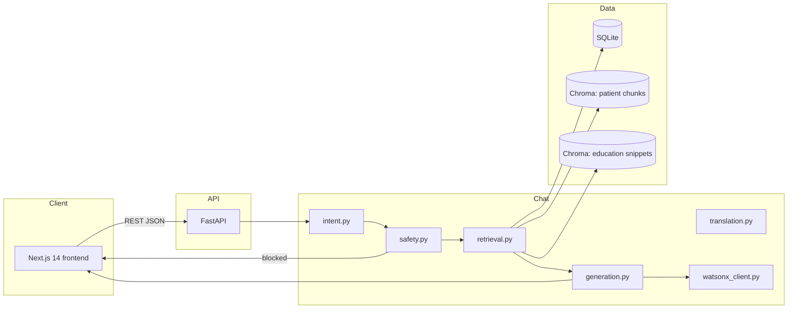
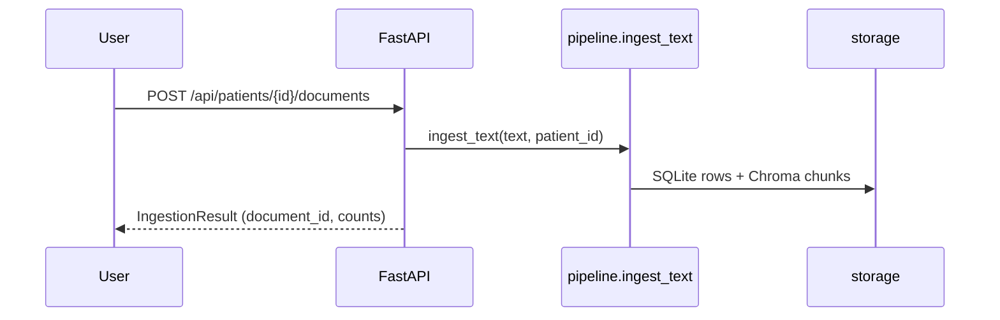

# Architecture

## System diagram (Mermaid)

## Data flow (ingestion)

## PNG diagram

If you need a slide‑ready raster, paste the first Mermaid block into [mermaid.live](https://mermaid.live) and export PNG as `docs/architecture_diagram.png`.
